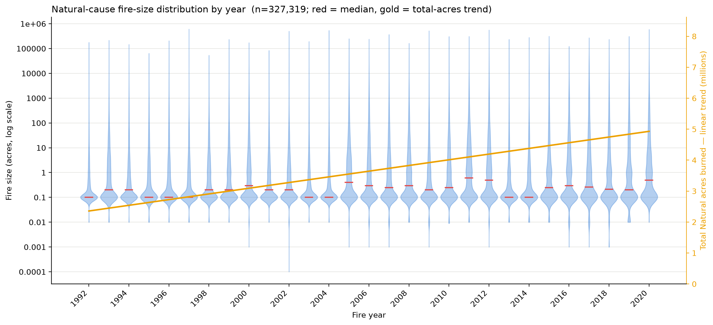

# Weekly Status Report

| Name | | Week / Date | |
| --- | --- | --- | --- |
|  Craig Rudman |  |  Week 3 / 2026-07-19 |  |

## Project title
Predicting Region-Season Wildfire Cause Patterns to Target Prevention and Mitigation

## Project summary

This project asks two linked questions. First, descriptively: across contrasting U.S. region-seasons, which wildfire causes **drive the most burned area**, and do those patterns differ enough to demand distinct prevention and/or mitigation strategies? Second, predictively: can a **next-season cause-risk profile** — the expected mix of causes for a region and upcoming season, ranked by the burn each is expected to drive — be predicted well enough to pre-target that effort? The goal is to let a state or regional fire planner match the intervention to the pattern. The data is the Fire Program Analysis Fire-Occurrence Database (FPA-FOD): around 2.3M U.S. wildfires from 1992 to 2020. Fires are grouped by cause, EPA Level III ecoregion, and meteorological season. These historical patterns train an inferential model whose product is a **next-season cause-risk profile**. For a given region and upcoming season, that profile gives the expected composition of ignition causes. A planner can then pre-position prevention and mitigation effort against the causes most likely to dominate. Within each region-season, causes are ranked for impact by the predicted size of the fires they produce, so effort concentrates on the causes expected to drive the most burn — not merely the most ignitions. An exploratory goal is to layer in additional evidence — emergent risk factors beyond historical composition — to strengthen that inference.

## Milestones

- Data acquisition: load FPA-FOD 2.3M edition (1992–2020), confirm schema and record count
- Feasibility assessment: sample-scale approach validation, missing-cause and regional-contrast checks
- EDA: cause × year composition; Natural-cause size distribution; human-cause composition; missing-cause characterization
- Cleaning: documented exclusion; EPA Level III ecoregion spatial join (CONUS **and** Alaska layers); derive meteorological season + sequential season-year index; preserve FIRE_YEAR; write the fire-level and region-season-cause artifacts
- Feature engineering: lagged burn/cause history (t-1, t-4), log fire size, per-region dominant-cause share, per-cell missing rate as a data-quality weight; optional climate/fuels integrations as predictive-lift hypotheses (lagged to pre-season, no leakage)
- Modeling: persistence baseline first; predict region-season cause composition; predict expected burn size per cause to weight impact; forward-chaining temporal split; ablation ladder vs. baseline
- Findings & prevention strategies: rank causes within each region-season by predicted burn impact; translate contrasting archetypes into matched prevention recommendations; write up

## Last week's "To Do"

- Move from the 400K seeded sample to the **full 2.3M-record load**; drop/flag Missing causes; run the ecoregion spatial join at full scale.
- Derive **meteorological season** and the **sequential season-year index**; preserve `FIRE_YEAR`.
- Begin **EDA proper**: full-scale cause × region × season composition and a year-over-year variability check (to settle whether the target is static or dynamic).
- Produce a reportable **missing-cause sensitivity bound** on the full data.

All four are addressed below. Two changed shape: the sensitivity bound was superseded by a stronger analysis (see *Missingness*), and the region half of the composition check is deferred to next week — the region *key* is built and validated, but the descriptive comparison across ecoregions is not yet done.

## This week's progress

Three milestones moved: **EDA** (`notebook/eda.ipynb`), a new **missingness** investigation split into its own notebook (`notebook/missingness.ipynb`), and **Cleaning**, now complete with artifacts written (`notebook/cleaning.ipynb`).

**The week started from the pod-lab insight — the per-year violin plot of Natural-cause fire size.** Reading it, I saw the mass above the median thickening over the record: Natural fires appearing to get bigger. That single observation set the agenda for everything below. It had to be verified against the data rather than the eye (it was — the ≥1,000-acre share roughly doubles), and it came with an alternative explanation I couldn't dismiss: Natural fire *counts* fall in the same years, so a shrinking denominator could manufacture the whole trend. Chasing that alternative is what produced the missingness investigation, and chasing *that* is what exposed the Alaska problem in the cleaning join. The insight, in short: **the violin showed a fire-behavior trend and a data-quality trend that look identical, and separating them was the week's real work.**

### EDA — the year-over-year variability check

*Natural-cause fire-size distribution by year (n=327,319; red = median). Density is estimated on `log10(FIRE_SIZE)` so the nine-order-of-magnitude skew doesn't crush it, with the axis relabeled back to acres. **The upper body thickening after ~2005 is the pod-lab observation that drove this week's work** — and the one that could not be told apart from a reporting artifact until the missingness probes below.*

- **Loaded the full 2.3M-record table** (2,303,566 fires, 38 columns, 1992–2020, 52 states/territories, 180.0M acres). Every analysis key is 100% non-null; cause is the one field with a real gap, and it is not a null — it is a `Missing/undetermined` **category** holding 26.0% of records.
- **Fire size is extreme, and it justifies the whole design.** Median 0.80 acres, mean 78.2, max 662,700. The **top 1% of fires carry 89.7% of all burned acres** (top 0.1% carry 64.3%). This is the empirical reason the project weights cause by acres instead of counting ignitions: a count-based profile would be dominated by fires that burn almost nothing.
- **Cause composition over time.** Natural is the dominant and most volatile driver, running 40–88% of a year's burned area with spikes in 2004, 2006, 2012, 2015, 2017, and 2020. `Missing/undetermined` is the second-largest slice and it grows: **19% → 31% of burned area** (1992–96 vs. 2016–20), and **21% → 34% of fire count**. That is a data-quality trend, not a fire trend, and it matters directly for the product — attribution is least complete in exactly the recent years a next-season forecast leans on.
- **Natural-cause deep-dive (the pod-lab plot).** The per-year violin plots on a log size axis — the chart I brought to pod lab — showed the upper tail thickening; verified against the data, the share of Natural fires reaching ≥1,000 acres roughly doubles, with growth at the ≥10 and ≥100-acre thresholds too. The honest counter-read was shown alongside: yearly Natural fire counts fall in recent years, so a shrinking denominator could manufacture the trend — especially if the fires leaving the Natural count are being reclassified as Missing, which would make the loss size-correlated. Recorded as an open hypothesis, and then actually tested — see *Missingness* below.
- **Human-caused composition shift.** Human causes are **22.6% of all burned acres** (Natural ~59%, Missing ~19%). Renormalized within human acres, small-multiples panels show Arson/incendiarism and Debris/open burning trending down while Equipment/vehicle use and Power generation/transmission trend up. Consistent with a testable **human-incursion (WUI) hypothesis** — more people and development pushing into fire-prone land, shifting the mix from intentional/rural ignitions toward accidental/infrastructure ones. Two limits keep this a lead rather than a finding: shares within human acres are compositional, so a decline in one cause can be an artifact of another rising, and "more people" is an exposure claim shares cannot measure.

### Missingness — the confound, tested rather than caveated

Last week I flagged the rising Missing-cause rate as an unresolved confound sitting underneath the Natural tail-growth finding. This week that hypothesis was tested directly, in its own notebook.

- **Missingness is not one phenomenon.** By reporting agency: `ST/C&L` (state/county/local, 1.7M of 2.3M rows) runs ~29% missing — ordinary case-by-case undetermined cause. `IA` runs **99.8%** missing and turns out to be almost entirely Puerto Rico (21,802 of 21,853 rows). PR (98.7%) and HI (98.1%) are functionally unattributed, not merely "differentially missing."
- **The post-2010 rise is real and uneven.** It survives removing PR/HI, so it is a genuine pattern in the CONUS/federal data. Decomposed by agency it concentrates: BLM +17 points (9%→26%), ST/C&L +12, FS +7, **BIA essentially flat**. A single national attribution standard applied uniformly would not produce one agency holding flat while another nearly triples. What the data cannot say is *why* — that would need attribution-practice documentation outside FPA-FOD, so it stays a labeled hypothesis.
- **Missingness vs. fire size is three regimes, not a gradient.** A ~29% bump among the smallest fires, a **flat ~20–25% band across four orders of magnitude** in the middle, and a clear **drop in the large-fire tail — 16.4% at ≥10,000 acres, 14.8% at ≥100,000**. The biggest, most consequential fires are the *best*-attributed part of the record.
- **Three independent probes of whether the Missing bucket hides Natural specifically.** A missing record's true cause is unobserved, so none of these can prove cause-neutrality; each looks for the footprint a non-random draw would leave in the attributed record. (1) *Compositional stability over time*, detrended: Natural r ≈ −0.02 — flat. The raw correlation is a trap and the notebook demonstrates it, since nearly every large raw r collapses once shared calendar drift is removed. (2) *Within region × season*, holding place and season fixed while preserving gradual drift: Natural r ≈ +0.02 — flat, and no cause shows the hiding signature. Arson's Test-1 flag (−0.52) **reverses to +0.21** under confound control, so that signal was compositional residue, not hiding. (3) *Cause mix by size*: this one returns a real effect — small fires are 32% Debris / 12% Natural, while the ≥10k-acre tail is **78% Natural / 3% Debris**. So the Missing bucket *is* size-selective — but what it under-samples is the small, **human**, Debris-heavy end, not Natural, and that bias lands on the count view the project does not use.

**Bottom line on the confound: the absorption hypothesis has no supporting evidence under either probe.** The Natural tail-growth finding is not explained away by Natural fires being relabeled Missing. One caveat stays open rather than closed: the acre-weighted within-cell Natural correlation is −0.20, but about half of that comes from a single cell (`AK|Summer`, r = −0.61, ~19% of the acre weight), and removing Alaska halves it to −0.10. That residual is a precision-and-edge-case caveat, not a bias that would require the unattributed records back.

### Cleaning — complete, with artifacts

- **Exclusion applied:** `STATE in ('PR','HI') OR NWCG_REPORTING_AGENCY == 'IA'` — 32,223 rows (1.40% of records) but only **0.36% of burned acres**. It is a data-quality rule and the only exclusion. The missing-cause rate on what remains is 24.9%, the ordinary undetermined level.
- **Alaska was being silently dropped, and is now recovered.** The EPA Level III shapefile is explicitly the *conterminous* US layer, so Alaskan points fell outside it and were lost incidentally by the spatial join — taking **20.4% of all burned acres (36.7M of 180M)** with them, a fifth of the dependent variable. Earlier plan documents said "AK/HI at state grain," but nothing had implemented that; Alaska was simply lost. Fixed by joining a **second layer** (EPA Level III Ecoregions of Alaska), whose attribute schema matches the CONUS layer field-for-field, so Alaska now enters the same `region` column at the same Level III grain — **no state-grain exception anywhere in the design**. Each join runs in its own layer's CRS with the fire points reprojected to match, since forcing Alaska into CONUS Albers would distort it badly at those latitudes. Join quality: **99.97% of acres matched** overall (CONUS 99.99%, Alaska 99.93%), across 105 ecoregions.
- **Temporal spine derived.** Meteorological season (DJF/MAM/JJA/SON) plus `season_year` and a monotonic `season_idx` spanning 0–116 with no gaps, so "next season" is a `+1`, the persistence baseline is a `shift(1)`, and the forward-chaining split is a threshold on one column. **December is assigned to the winter that ends the following calendar year** (70,119 fires, 1.45M acres), so each physical winter is one contiguous unit rather than split across two calendar years. `FIRE_YEAR` is preserved unchanged, so the static-vs-dynamic target question stays open.
- **Level III is a viable grain — checked before modeling, because the answer changes the design.** Across 402 region × season series, the median carries 29 of a possible 30 season-years; **86% have ≥20 years, covering 99.6% of attributed acres**. The Level II roll-up is prepared as a fallback (`na_l2name` carried alongside, so coarsening is a `groupby` change rather than a re-join) but is not needed.
- **Two artifacts written and round-trip verified:** `data/fires_clean.parquet` (2,271,343 fires × 43 columns, keys attached) and `data/region_season_cause.parquet` — the analysis grain, 123,312 rows = 10,276 region-seasons × 12 causes. The grid is densified so an absent cause reads as the real zero it is and shares sum to 1 in every cell. Each cell also carries its own `missing_acre_frac`, so poorly attributed region-seasons can be down-weighted instead of being treated as equally trustworthy.

**Bottom line: the region-season cause mix is not static.** Both the Natural-cause size distribution and the human-cause composition shift materially across the 29-year record, which argues for a year-aware target rather than a mix pooled across all years. The persistence baseline still gets built first — it is the thing added complexity has to beat — but the evidence says it is unlikely to be sufficient alone. One honesty note: this reads the *temporal* axis only. The region axis of the same question is next week's work.

## Issues & discussion

- **The missing-cause confound is resolved as a blocker, not deferred as a caveat.** Last week I said the Natural tail-growth and human-composition findings were entangled with the rising Missing rate and could not be reported as fire trends. Three convergent probes now find no evidence the bucket selectively hides Natural, and the size-selectivity it *does* show lands on the count view rather than the acre-weighted product. The standing stance — report cause as shares within attributed fires, weighted by acres — neutralizes every bias cleanly established here. What remains is a **precision** problem rather than a bias one: high-missing cells are disproportionately recent western region-seasons, which is exactly what a next-season forecast leans on, so each cell's missing rate is carried as a data-quality weight rather than assumed away.
- **Alaska is where the caveat bites hardest, and it now needs a decision.** It is a fifth of the burned acres, its summer acres are set by a handful of enormous lightning complexes, and it drives the one non-flat number in the entire missingness analysis. Now that it is inside the ecoregion grain rather than silently absent, I need to decide whether it is modeled with everything else or flagged as an edge case in the product.
- **Still deferring the population/WUI layer** needed to confirm the human-incursion hypothesis. Flagging for visibility; no action needed yet, and deliberately held until the base data shows what it can do.

## Next week's "To Do"

- **Extend the descriptive comparison to the region dimension** on `region_season_cause.parquet`: cause × ecoregion × season composition, and identify the contrasting region-season archetypes RQ1 compares.
- **Build the persistence baseline** ("region-season = its own last occurrence") via `season_idx.shift(1)`, and settle the scoring metric for a predicted cause composition.
- **Set up the forward-chaining temporal split** on `season_idx`, including a rule for the boundary season-years (1992 and 2021 are partial winters by construction).
- **Decide Alaska's modeling treatment** — in-grain with everything else, or flagged as an edge case.

## Resources (optional)

- EDA notebook: `notebook/eda.ipynb`
- Missingness notebook: `notebook/missingness.ipynb`
- Cleaning notebook: `notebook/cleaning.ipynb` → `data/fires_clean.parquet`, `data/region_season_cause.parquet`
- Feasibility notebook: `notebook/feasibility.ipynb`
- Short, K. C. (2022). *Spatial wildfire occurrence data for the United States, 1992–2020* (6th ed.). USDA Forest Service Research Data Archive. https://doi.org/10.2737/RDS-2013-0009.6
- U.S. EPA. *Level III Ecoregions of the Conterminous United States*; *Level III Ecoregions of Alaska*.

---

> **How it's graded:** Concrete, verifiable progress against your plan; clear enough that a reader can follow your project's state; and real blockers named with a next-week plan.
