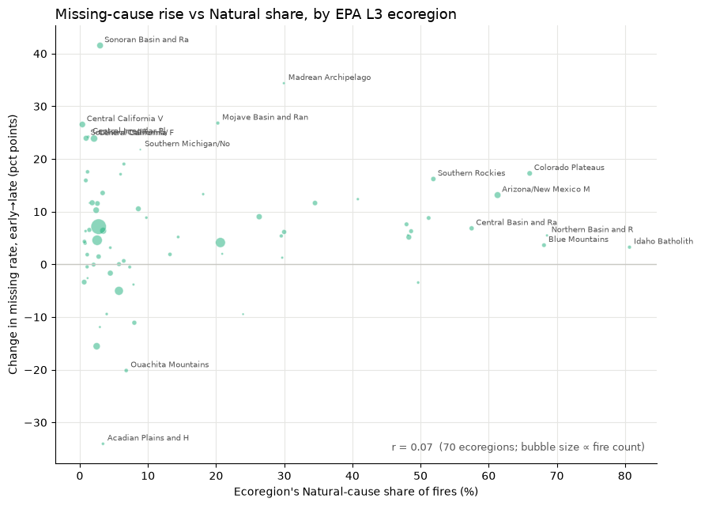

# Insight Rewrite Activity

**Source exchange:** Collaboration Log [Entry 3.6](../collaboration_log.md), 2026-07-14 to 2026-07-15

**Figure:** [`img/missing_natural_ecoregion_scatter.png`](../../img/missing_natural_ecoregion_scatter.png) — change in missing-cause rate (early→late) vs. natural-cause share, one bubble per EPA Level III ecoregion

**Question on the table:** does the "Missing/undetermined" bucket absorb fires that would otherwise be labeled natural-cause?

---

## Before — the describe-and-wave

> The relationship between missing-rate change and Natural share is essentially flat — r ≈ 0.07. The points form a diffuse cloud with no discernible trend. There is no evidence that ecoregions with a higher Natural share saw larger increases in missing-cause labeling. This is worth keeping in mind as a caveat when interpreting the cause composition results.

---

## After — the rewrite

### Describe

Each bubble is one EPA Level III ecoregion, sized by fire count. Reading across, the horizontal axis is the share of that ecoregion's attributed fires that were natural-cause: near zero on the left, which is human-ignition country, and above 50% on the right, in the lightning-driven federal West. The vertical axis is how far that ecoregion's missing-cause rate moved between the early period and the late one.

The cloud doesn't tilt — r is 0.07. But the two halves of the plot behave quite differently.

**On the left, ecoregions move both ways, and they move hard.** Sonoran Basin is up 41 points, Madrean Archipelago up 34, and the Central California Valley cluster around 24 — while Acadian Plains falls 34 and Ouachita Mountains falls 20. That's a spread of roughly ±40 points with no consistent direction.

**On the right, the spread collapses and the sign stops changing.** Every ecoregion above 50% natural-cause sits on the positive side: Colorado Plateaus +17, Southern Rockies +16, Arizona/New Mexico Mountains +13, with Northern Basin, Blue Mountains, and Idaho Batholith between +3 and +9. These are small moves — but **not one of them is negative.**

### Interpret

The correlation lands near zero because the left half swings symmetrically in both directions and averages itself out. That symmetry is precisely what hides the asymmetry on the right, where what matters isn't the size of the movement but the absence of any downward movement at all.

And that direction is exactly what you would expect if natural-cause fires were increasingly being recorded as "undetermined." Were that happening, the rising missing rate should show up precisely where natural-cause fire dominates — which is where it shows up, without exception.

**But direction alone is not evidence.** The effect is small: +3 to +17 points, set against swings of ±30–40 among the human-dominated ecoregions. A modest missing-rate rise in the West is also explained just as well by a general decline in reporting that happens to touch those regions along with everywhere else. On its own, a rising missing rate can't separate "natural-cause fires being relabeled" from "all causes going unrecorded a little more often."

The verdict is that the pattern is **weakly consistent with natural-cause fires being relabeled as undetermined, but it is not evidence for it — the scatter neither confirms it nor rules it out.** The large two-directional swings on the left are a separate story altogether: reporting practice churning locally, something a relabeling of natural-cause fires doesn't explain and doesn't need to.

### Implication

1. **Treat this as a data-quality phenomenon and model cause as shares within attributed fires** — never as raw counts, which would carry the reporting trend straight into the target.

2. **The question of whether natural-cause fires are being relabeled stays open, and stays scoped.** A null correlation doesn't dismiss it, and a directional hint doesn't settle it. It does have a named test: track natural-cause counts against missing-cause counts over time *within* the high-natural-cause western ecoregions, where relabeling would make the two move as mirror images. The answer bears on whether the trend in the natural-cause large-fire tail is real or a labeling artifact.

3. **The burned-area-weighted product carries a live precision caveat in the West.** If natural-cause fires are being relabeled at all, it is happening where natural-cause fire drives the most acres — and that is exactly where this product concentrates its ranking. That's a specific exposure, not a general disclaimer.
