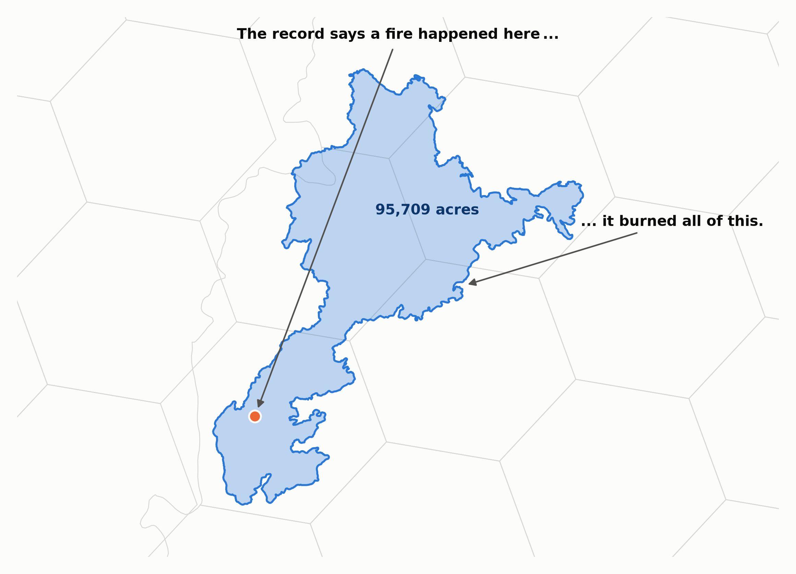
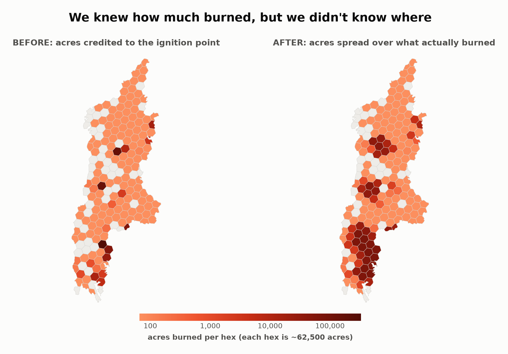

# Weekly Status Report

| Name | | Week / Date | |
| --- | --- | --- | --- |
|  Craig Rudman |  |  Week 5 / 2026-08-02 |  |

## Project title
Predicting Region-Season Wildfire Cause Patterns to Target Prevention and Mitigation

## Project summary

This project asks two linked questions. The first is descriptive: across contrasting U.S. region-seasons, which wildfire causes burn the most acres, and do those patterns differ enough to call for different prevention or mitigation strategies? The second is predictive: can I forecast next season's mix of causes for a region well enough to target that effort before the season starts? The goal is to let a state or regional fire planner match the response to the pattern.

The data is the Fire Program Analysis Fire-Occurrence Database (FPA-FOD), about 2.3M U.S. wildfires from 1992 to 2020. I group the fires by cause, EPA Level III ecoregion, and meteorological season, then train a model on those historical patterns.

The model works in two steps. First it splits a region-season's burned acres across three broad classes: Human, Natural, and Unknown, where Unknown means the record never recorded a cause. Then each class gets its own follow-on model, because each one raises a different question.

The forecast that answers the predictive question comes from the first step plus the Human class. For a given region and upcoming season, it gives the expected mix of ignition causes, ranked by how many acres each is likely to burn rather than by how many fires it starts. That lets a planner put prevention effort where the acres are. The Natural class asks a different question — where the acres will concentrate — because lightning cannot be prevented, only planned around. The Unknown class treats unrecorded causes as a sign of weak reporting and points to the regions and data sources where better cause data would help most.

## The research questions, restated

This report refers to my two research questions, so I'll restate them here:

- RQ1 (descriptive): Across a set of contrasting U.S. region-seasons, which wildfire causes (natural and human) drive the most burned area, and do those patterns differ enough to demand different prevention and mitigation strategies?
- RQ2 (predictive): Can a next-season cause-risk profile — the expected composition of causes for a region and upcoming season, ranked by the burned area each is expected to drive — be predicted well enough to pre-target that prevention effort?

## Milestones

- Data acquisition: load FPA-FOD 2.3M edition (1992–2020), confirm schema and record count
- Feasibility assessment: sample-scale approach validation, missing-cause and regional-contrast checks
- EDA: cause × year composition; Natural-cause size distribution; human-cause composition; missing-cause characterization
- Cleaning: documented exclusion; EPA Level III ecoregion spatial join (CONUS and Alaska layers); derive meteorological season + sequential season-year index; preserve FIRE_YEAR; write the fire-level and region-season-cause artifacts
- Method design & justification: settle the model structure (flat vs. hierarchical) and defend the estimator choice against the alternative
- Feature engineering: lagged burn/cause history (t-1, t-4), log fire size, per-region dominant-cause share, per-cell missing rate as a data-quality weight; optional climate/fuels integrations as predictive-lift hypotheses (lagged to pre-season, no leakage)
- Modeling: persistence baseline first; predict region-season cause composition; predict expected burn size per cause to weight impact; forward-chaining temporal split; ablation ladder vs. baseline
- Findings & prevention strategies: rank causes within each region-season by predicted burn impact; translate contrasting archetypes into matched prevention recommendations; write up

## Last week's "To Do"

- Source the drought/fuels data for the Natural branch and populate the wired external-covariate stub — the megafire result makes this the clearest path to predictive lift. Pre-season values only, so no leakage risk.
- Add a learned rung to the Human branch (and a per-branch `k`-sweep), to test whether its region-structured sub-cause mix is predictable beyond persistence — the Tier-1 pattern applied to the RQ2 partner.

## This week's progress

Week 5's assigned focus is executive communication, so the two visuals below carry
the week's argument. The argument is a request: fund the next phase, which adds
pre-season satellite and climate data to the model. This week built the thing that
request depends on.

Neither of last week's two To Do items was completed as written. The reason is the
first visual, and it is worth stating plainly before the pictures.

### The gap

Tier 2's Natural branch has to answer *where* — for an upcoming ecoregion-season,
which places will carry the acres. Lightning cannot be prevented, so the only useful
product is a location the planner can pre-position against. Week 4 left the working
grain open, noting it "may need to go finer than Level III." Going finer is what
broke.

> The Tepee Springs fire, Idaho Batholith, 2015 — 95,709 acres across two grid
> cells. The orange dot is the entire spatial record: one latitude and longitude.
> A grid cell holds ~62,494 acres, so this single fire is larger than the cell it
> is filed under. It is the median-size fire among those that cross more than one
> cell, which is two thirds of all satellite-mapped fires.
>
> *Location from FPA-FOD; burned area from MTBS satellite perimeters.*

FPA-FOD stores a pinpoint ignition location, but `FIRE_SIZE` describes an area. At
EPA Level III grain that mismatch stays inside the polygon and does no harm. On a
hex grid it dominates: a grid cell is about 62,494 acres, so any larger fire
provably cannot fit inside the one cell its ignition point falls in. Tepee Springs
is exactly that case — at 95,709 acres it is half again the size of the cell the
record files it under. Two thirds of the fires with known perimeters span more than
one cell. A cell-level acres target built from points would have measured
point-attribution error and called it fire behavior.

That also re-sequenced last week's plan. The drought and fuels covariates were
Natural-branch work, and fitting them against a target that measures attribution
error would have produced a meaningless ablation. The target had to be fixed first.

### The fix was already in the record

The correction did not require new data. The FPA-FOD `Fires` table carries
`MTBS_ID`, a foreign key into MTBS satellite-derived burn perimeters. Only 13,870
fires — 0.6% of rows — resolve through it, but those fires carry **81.6% of all
burned acres** (146.9M of 179.3M). The remaining 2.29M point-only fires average 14
acres, far smaller than a single hex, where a point is a perfectly good locator.

> The same fires and the same acres, placed two ways, for the Klamath Mountains in
> the 2020 season. **BEFORE:** every fire's acreage assigned to the single cell
> holding its ignition point. **AFTER:** acreage distributed across the cells the
> fire actually covered. The burn scars in the AFTER panel are real and continuous;
> the isolated dark cells in the BEFORE panel are an artifact of where a fire
> happened to start.
>
> *Burned area from MTBS satellite perimeters; locations from FPA-FOD.*

Acres are conserved by construction — each fire's distributed weights sum to 1.0 —
so the right panel is a re-placement, not a re-estimate. Scaled nationally the
method holds: 36,234 hexes across 105 ecoregions, with **99.61% of burned acres
landing on-grid**. The 0.39% that falls off is coastal and accounted for rather than
silently dropped.

### What it bought, and the ask

The result is not only a better Natural-branch target. It is the frame the next phase
needs. Satellite and climate layers are gridded products; they cannot be meaningfully
joined to an irregular EPA Level III polygon, but they join cleanly to a hex grid.
Burned area and fuel-condition imagery now share a common unit and can sit on the
same rows for the first time.

**The ask is to fund the imagery arc as the next phase.** The justification is not a
projected win — it is a measured limit. Week 4 established that a region's own burn
history under-predicts record fire years by one to nearly two orders of magnitude,
and that year-over-year burn magnitude is barely autocorrelated (r = 0.072). History
says which places burn; it does not say when a season will burn big. Pre-season fuel
condition — how much fuel has accumulated and how dry it is — is the most plausible
source of that missing signal, and it is now joinable. If it fails to beat the cheap
prior-burn proxy, that null is itself a reportable finding, and the ablation ladder
is built to show it either way.

### Built this week

- `src/hex_burn.py` — perimeter-to-hex acre distribution. Per-fire weights sum to
  1.0, so acres are conserved; point-only fires get full weight on their containing
  hex.
- `notebook/10_hex_burn_demo.ipynb` — three proof-of-concept regions, then scaled
  national. Acre conservation verified at both scales.
- `src/w5_visuals.py` + `notebook/11_w5_visuals.ipynb` — figures rendered with no
  headline text baked in, so the assertion lives in the report rather than the PNG.
- Artifacts: `data/hex_grid_res5.parquet`, `data/hex_acres_res5.parquet`,
  `data/mtbs_perimeters/`.

MTBS join quality was characterized rather than assumed: 1,144 of 13,870 IDs do not
resolve, splitting into 478 agency-prefixed IDs that use a different scheme entirely
and 666 that are genuinely absent from the published perimeter set. Among
correctly-formatted IDs the join rate is 95.8% of acres.

## Next week's "To Do"

- Source the pre-season fuel-condition and climate layers now that there is a grid to
  join them to. **This is blocked**: no Earthdata or Google Earth Engine credentials
  exist on this machine yet. Resolving access is the first task, and it is the single
  live risk to the next phase.
- Add a learned rung to the Human branch, carried over from last week — the RQ2
  forecast partner, and the item that does not depend on the imagery blocker.
- Enforce the leakage rule as the imagery features are built: every index must
  aggregate over pre-season months ending strictly before the target season opens. A
  window overlapping the season reads the burn scar itself and yields a spectacular,
  circular result.

## Resources (optional)

- W5 plan: `coursework/W5/w5_plan.md`
- `src/hex_burn.py`, `src/w5_visuals.py`; `notebook/10_hex_burn_demo.ipynb`,
  `notebook/11_w5_visuals.ipynb`
- Short, K. C. (2022). *Spatial wildfire occurrence data for the United States,
  1992–2020* (6th ed.). USDA Forest Service Research Data Archive.
  https://doi.org/10.2737/RDS-2013-0009.6
- Eidenshink, J., Schwind, B., Brewer, K., Zhu, Z., Quayle, B., & Howard, S. (2007).
  A project for monitoring trends in burn severity. *Fire Ecology*, 3(1), 3–21.
  (MTBS burn perimeters.)
- U.S. EPA. *Level III Ecoregions of the Conterminous United States*; *Level III
  Ecoregions of Alaska*.
