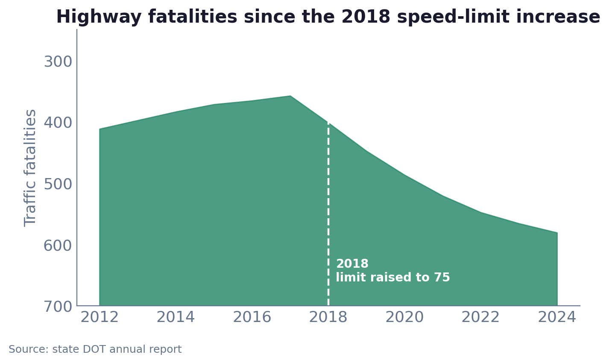
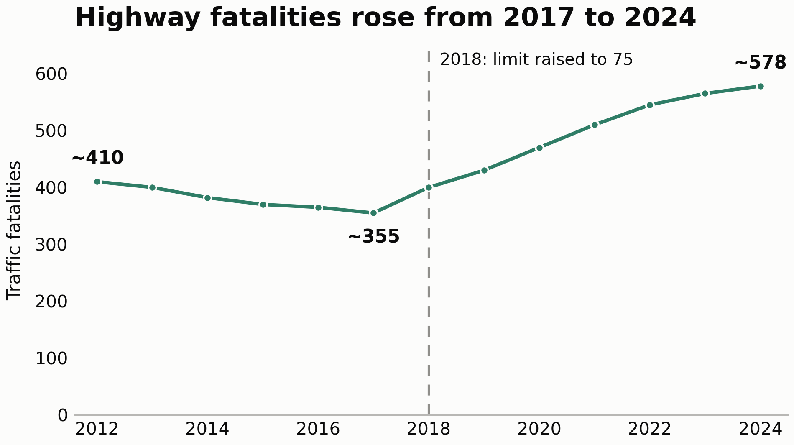
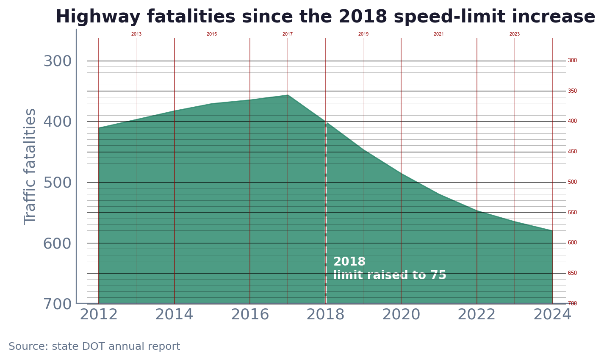

# Week 5 · Chart Redesign: Find the Lie, Then Fix It

**Name:** Craig Rudman 
**Course:** MSDS696 Practicum II 
**Due:** August 2, 2026

---

## Chart selected

**Chart B — Highway fatalities.** A state DOT chart covering a speed-limit change.

**Source:** Chart bank, D2L Content → Week 5

### Original chart

---

## 1. Name the lie

<!-- Which distortion, and the mechanism. What does the chart make a reader believe, and what does the data actually say? Give the numbers. -->

### Distortion 1 — Inverted y-axis (dominant)

The y-axis runs backwards: 300 at the top, 700 at the bottom. Fatalities rose after the 2018 speed-limit increase, but because larger values are plotted *lower*, the top edge of the shaded region descends across those years — the shape a reader knows as a decline.

**Mechanism:** a reader decodes slope before reading axis labels. Down-and-to-the-right means "less" in every chart they have seen. The inversion borrows that reflex and points it at a rising series, so the chart does not need to state a falsehood — the reader supplies it.

**What a reader believes:** fatalities fell after the limit was raised to 75.

**What the data actually says:** fatalities were *falling* before the change and rose sharply after it. Measuring values against the chart's own axes: ~410 in 2012, ~355 in 2017, ~400 in 2018, ~578 in 2024. Across the seven pre-change years fatalities fell ~10, reaching a low of ~355 in 2017 — a decline of ~55 from 2012 — before ticking back up in 2018. Across the six years after, they climbed ~178. The pre-2018 trend does not merely slow; it reverses. Over the full window fatalities rose ~168.

The chart dates the change to 2018 but not to a point within it, so how much of the 2018 count falls under the new limit is unknown — anywhere from none of it to nearly all. I therefore keep 2018 in the pre-treatment group: assigning a partly-untreated year to the post-treatment side would credit the new limit with deaths that may have occurred under the old one. That makes the comparison seven years against six.

### Distortion 2 — Truncated y-axis

The axis spans 300–700 rather than starting at zero. The ~168-fatality change (approx. 410 → 578) is drawn against a 400-unit window, so it fills roughly half the plot height. The shaded fill — which reads as volume — is cropped at 300, so the eye has no floor to measure against.

**Mechanism:** with no zero baseline the reader has no anchor for the *level*, only the movement. The post-2018 climb is a real departure from the flat stretch before it, but the cropped axis makes it look steeper than it is.

### Flagged, not charged — possible selective window

The series begins in 2012 and the chart gives no reason for that start date. Seven years of pre-change data is enough to establish a trend line the reader will take as "normal," and that flat-to-declining stretch is what makes the post-2018 climb look like a departure. If those seven years were themselves unusual — a local trough, a reporting change, a period already trending down — the comparison the chart invites would be against an atypical baseline.

This is a question the chart raises but does not answer, and I cannot settle it from the image: the years before 2012 are simply absent. I flag it as a reason to ask for the full series rather than as a distortion I can demonstrate. Unlike the inverted and truncated axes, which are visible in the chart itself, a selective window can only be proven with data the chart withholds.

### Flagged, not charged — no control for a causal claim

The dashed 2018 line and the title frame this as the effect of an intervention, but a single before-and-after series cannot support that reading. There is no comparison group (e.g. no neighboring state that kept its old limit, no class of road the change did not apply to), so any statewide trend over the same period (vehicle miles travelled, phone use, vehicle mix, enforcement, weather) is indistinguishable from the effect of the speed limit. The chart shows what happened after 2018, not what happened because of it.

It's important to note that this one differs from the two charged distortions in an important way: it survives the rebuild. Correcting the axes changes which direction the reader infers, but a lone pre/post series with a line drawn at the intervention still invites a causal read.

---

## 2. Name the victim

<!-- Who could be misled, and what decision would they get wrong? -->

The chart is published by the agency whose policy it evaluates, which is what makes it dangerous: it reaches the people who decide whether the policy continues, and it reaches them as an official record.

The subject matter raises the stakes further. These are deaths, not sales figures, and an agency reporting on a policy whose first six years coincided with a ~178-fatality rise has an institutional interest in how that record reads — exposure to liability, legislative scrutiny, and public accountability all turn on it. I am not claiming to know the chart's author intended to deceive; intent cannot be read off an image. But the incentive to present this particular series favorably is real, and it is the reason a reader should treat a self-evaluation of this kind as an argument rather than as a neutral report.

### Citizens and their state representatives

**The decision at risk:** whether to keep the 75 mph limit, extend it to more highway miles, or repeal it.

**How it goes wrong:** a legislator reviewing the change sees a downward slope and reads it as vindication — the limit went up and the roads got safer, so the obvious move is to extend it. The reading is backwards twice over. Fatalities did not fall; they rose ~178 over the six years after the change, having drifted down ~10 over the seven years before. A representative who would have voted to repeal on the real numbers instead votes to expand, and the constituents who bear the consequence are the ones driving those roads.

---

## 3. Rebuild it

### Rebuilt chart

*Source: state DOT annual report. The underlying series was not published; values are measured from the original chart's own axes and are approximate.*

### Fixes applied

The first three address the distortions charged in section 1. The rest are consequences of those fixes or of the projection context, and are listed so the comparison is complete.

| # | What I changed | Why |
| --- | --- | --- |
| 1 | **Un-inverted the y-axis** — 0 at the bottom, larger values higher. | Fixes Distortion 1. The rise now reads as a rise. This is the whole lie in one change: nothing about the data moved, only the direction the axis runs. |
| 2 | **Extended the axis to a zero baseline**, top set at 650, just above the ~578 maximum. | Fixes Distortion 2. Fatality counts have a meaningful zero, so the height of a point now means something. The cost is honest: the ~168-fatality change occupies less of the panel than it did at 300–700, because that is its true size relative to the level. |
| 3 | **Rewrote the title** from "Highway fatalities since the 2018 speed-limit increase" to "Highway fatalities rose from 2017 to 2024." | The original's title names the policy and lets the inverted axis supply the verdict. The replacement states the direction of travel and bounds it by two years a viewer can check against the labeled points. |
| 4 | **Kept the 2018 marker, dropped the causal framing.** The dashed rule and "2018: limit raised to 75" remain; nothing claims the limit caused the change. | The policy date is genuine context and belongs on the chart. Attributing the rise to it is not supported — there is no comparison group (see section 1). The marker sits inside the span the title names and the viewer draws their own conclusion. |
| 5 | **Switched the filled area to a line** with visible points. | The original's fill invites reading shaded mass as quantity, and on a zero baseline most of that mass is empty space below a series that never drops under ~355. A line carries the level without implying volume. |
| 6 | **Labeled three points directly** (~410, ~355, ~578) instead of none. | The original made the viewer decode every value off an inverted axis. Naming the start, the trough, and the endpoint puts the numbers the argument rests on directly in the reader's eye. |
| 7 | **Removed the gridlines and sized the type for projection** (1920×1080, 19–30pt). | Assumes the chart is shown on a screen rather than read on paper. With the three key values labeled, ruled lines competed with the series for attention at distance without adding information. |

**Data note:** the underlying series was never published, so values are recovered from the original PNG by pixel measurement rather than estimated by eye. Its axes were calibrated from their own tick-label centers — 300 → row 143.0 and 700 → row 717.0 vertically, 2012 → column 232.5 and 2024 → column 1304.0 horizontally — and the 2018 gridline predicted by that fit falls within 0.25 px of its actual position, so the mapping is sound. Values remain approximate and are labeled as such throughout.

*The measurement, shown. Horizontal lines every 10 fatalities (heavier every 50), vertical lines at each year, both derived from the original's own tick labels. Reading the series against this grid is what produced the values above — and what corrected an earlier eye-read estimate of ~590 for 2024 to ~578.*

**Tool:** Python 3 / matplotlib, with Pillow for the calibration measurement. The rebuild is scripted in [`rebuild_chart.py`](rebuild_chart.py) and the grid overlay in [`calibration_grid.py`](calibration_grid.py); both are reproducible from the original PNG.

---

## 4. Say what you preserved

<!-- The real, defensible message of the rebuilt version — a sentence someone could act on. Don't over-correct into a shrug. -->

**Preserved message:** highway fatalities fell to ~355 in 2017 and then rose to ~578 by 2024, and that reversal is coincident with the 2018 speed-limit increase — enough to justify a formal evaluation of the policy, not enough to convict it.

### What the 2018 annotation is doing

The rebuild keeps the dashed marker and the "limit raised to 75" label. That is deliberate, and it serves two purposes.

**First, it undoes the lie on its own terms.** The original chart set out to show fatalities against the speed-limit change; the inverted axis is what turned that comparison into a false one. Removing the marker would have produced an honest chart that no longer answered the question the original asked. Keeping it, with the axis corrected, shows the increase in fatalities *relative to the intervention* — which is precisely the comparison the original claimed to be making and inverted instead.

**Second, it opens the question of causation rather than closing it.** The marker sits inside the span the title names, so a viewer can see that the rise and the policy change coincide. What follows from that is a research question, not a finding. If the upward trend can be established as more than chance variation, then the defensible statement is that it is *coincident* with the limit increase — no stronger. The effect of the intervention remains confounded by factors this chart cannot see: traffic volume, vehicle mix, enforcement levels, phone use, weather, and any other statewide trend over the same thirteen years. With no comparison group, coincidence is the ceiling.

### Why it still has a point

The honest chart is not a shrug. It supports an action: a planner or legislator looking at it has grounds to commission a proper evaluation — a comparison against states that did not raise their limits, or against road classes the change did not touch — before extending the policy further. That is a smaller claim than the original made, and a more useful one, because it is the claim the data can carry.

The original chart, read correctly, argued for expanding the limit. The rebuilt chart argues for finding out. Those are different decisions, and only one of them is supported by ~578 fatalities in 2024 against ~355 in 2017.
